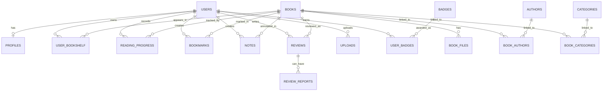
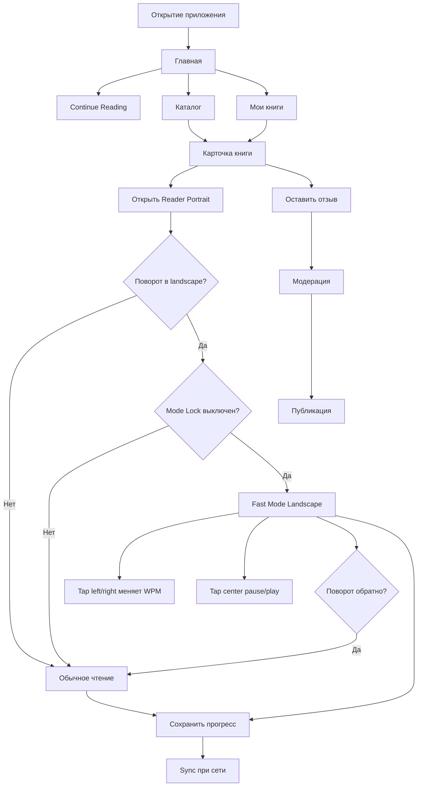

# Детальный план разработки и дорожная карта гибридного мобильного e‑reader

## Резюме для руководителя

Для MVP я рекомендую строить продукт как **гибридный ридер, а не как “спид‑ридинг‑читалку”**: в портретной ориентации пользователь читает в обычном ebook‑формате, а в ландшафтной автоматически переходит в fast mode с показом одного центрального слова и приглушённого контекста. Это лучше согласуется и с UX, и с тем, что исследования по RSVP‑чтению показывают компромисс между скоростью и пониманием: естественное чтение с возможностью регрессий по тексту остаётся важным для comprehension, поэтому fast mode должен быть вспомогательным режимом, а не единственным способом чтения. citeturn7search1turn7search10turn6search7

Для мобильного MVP без жёсткого ограничения по стеку наиболее рациональная базовая конфигурация — **Flutter + локальная SQLite/Drift‑слойка + Supabase (Postgres/Auth/Storage/RLS)**. Flutter официально позиционируется как нативно компилируемый мультиплатформенный UI‑фреймворк из одной кодовой базы; Supabase даёт Postgres, Auth, Storage, Realtime и policy‑контроль через Row Level Security; Firestore, в свою очередь, особенно силён встроенным offline‑режимом и синхронизацией на Apple/Android, поэтому его стоит держать как альтернативу, если команда решит пожертвовать реляционной чистотой модели ради более простого offline‑sync. Для предметной области “книги → авторы → категории → полки → прогресс → рецензии → бейджи” реляционный бэкенд обычно удобнее. citeturn0search1turn1search3turn1search11turn1search15turn1search23turn1search2turn1search6

По форматам файлов для MVP стоит сделать **EPUB и TXT первыми классами**, а **PDF — поддерживаемым, но с оговорками**. EPUB — это стандарт цифровых публикаций на базе HTML/CSS/SVG в контейнере, то есть он естественно подходит для reflow, пагинации и извлечения текста в fast mode. PDF нужно рендерить отдельным движком; на iOS для этого есть PDFKit, на Android — PdfRenderer и Jetpack PDF viewer. Для fast mode по PDF нужно опираться на наличие качественного text layer; для сканов fast mode лучше отключать или переносить в V1/V2 через OCR, например Apple Vision или Google ML Kit. citeturn1search0turn1search8turn14search4turn14search9turn14search17turn9search9turn9search0

Ключевое архитектурное решение: **не хардлокать ориентацию приложения глобально**. Переключение portrait → normal / landscape → fast должно жить внутри Reader‑сцены и уважать adaptive behavior ОС. Android при runtime‑смене ориентации по умолчанию пересоздаёт activity; Android 16+ уже ослабляет ориентационные ограничения на больших экранах; Flutter и Android guidance прямо советуют не злоупотреблять orientation lock как заменой адаптивному UI. Поэтому нужен именно **mode lock в ридере**, а не жёсткий orientation lock всего приложения. citeturn15search1turn15search16turn15search8turn15search2turn15search0

С юридической и store‑policy точки зрения безопаснее выпускать MVP как **ридер для пользовательских загрузок и лицензированного/общественного каталога без DRM‑продаж в приложении**. Если позже появится магазин книг или подписка на цифровой контент, на iOS понадобится StoreKit/In‑App Purchase либо отдельный анализ режима reader app и External Link Account Entitlement; на Google Play продажа цифрового контента в приложении подпадает под Play Billing. Публичные отзывы о книгах считаются user‑generated content и требуют модерации; если приложение создаёт аккаунты, и Apple, и Google требуют предоставить удаление аккаунта. citeturn3search6turn3search17turn4search0turn4search10turn19search0turn19search1turn19search2turn0search2turn0search3turn8search1turn8search21

Ниже — рабочий план, с которого команда уже может начинать реализацию. Оценки сроков даны для команды уровня **1 product designer, 2 mobile/full‑stack инженера, 1 backend/shared инженер, part‑time QA**. Это не норматив, а рабочее допущение плана.

## Продуктовая рамка и ключевые допущения

Ценность продукта лучше формулировать так: **“мобильный ридер, который позволяет переключаться между глубоким и ускоренным чтением без потери текущей позиции”**. Такая формулировка честнее к пользователю и устойчивее к реальному поведению читателей: исследования по eye movements и RSVP показывают, что регрессии и естественные движения глаз часто помогают пониманию текста, а искусственное ограничение чтения одним словом за раз ухудшает часть comprehension‑сценариев, особенно на длинных и сложных текстах. Поэтому fast mode стоит позиционировать как инструмент ускоренного ознакомления, разогрева, повторного прохода или чтения более простых фрагментов. citeturn7search1turn7search10turn6search23turn6search6

Для самого продукта это означает четыре жёстких правила. Во‑первых, **позиция чтения должна быть общей** между normal и fast mode. Во‑вторых, переключение между режимами должно быть мгновенным и предсказуемым. В‑третьих, fast mode не должен обещать “магическое” повышение comprehension. В‑четвёртых, если текст неудобен для быстрой потоковой подачи — например, это сканированный PDF без text layer — система должна честно оставлять только normal mode. Такой “guardrail UX” уменьшает риск разочарования и поддержки “сломанных” кейсов. citeturn7search1turn6search0turn14search9turn9search9turn9search0

По форматам чтения рекомендую зафиксировать такой scope. **EPUB** — основной формат для каталога и импорта, потому что стандарт допускает структурированный, семантически размеченный и reflowable контент; **TXT** — дешёвый и надёжный формат для MVP; **PDF** — поддерживается как формат импорта и обычного чтения, но fast mode включается только после успешного извлечения текста и токенизации. Для EPUB удобно хранить локатор на базе EPUB CFI или эквивалентного канонического якоря; для PDF — page + text offset / extraction anchor. citeturn1search0turn21search7turn14search4turn14search9

Базовые продуктовые допущения для MVP я предлагаю зафиксировать так:

| Область | Решение для MVP | Комментарий |
|---|---|---|
| Основной язык | ru-RU | en-US как fallback |
| Платформы | iOS + Android | единый мобильный MVP |
| Режимы чтения | Portrait = normal, Landscape = fast | внутри Reader, не на уровне всего app shell |
| Форматы | EPUB, TXT, PDF | PDF fast mode только при хорошем text layer |
| Каталог | Собственный каталог + пользовательские загрузки | DRM‑free на старте |
| Социальный слой | Отзывы и рейтинги | без полноценной соцсети |
| Рекомендации | Правила + popularity + author/category affinity | без тяжёлого ML в MVP |
| Монетизация | Открытый вопрос | отложить до V1/V2 |

С UX‑точки зрения fast mode лучше делать с **центральным словом, приглушённым предыдущим и следующим словом, тапами left/right для изменения скорости и center tap для pause/play**. Круговой dial имеет смысл как вторичный, “точный” контрол, но не как единственный: при чтении быстрее работают дискретные taps с коротким визуальным feedback вроде `+25 WPM`. Из‑за ограничений comprehension лучше не подталкивать людей к экстремальным значениям по умолчанию; разумная стартовая матрица пресетов для onboarding — **200 / 275 / 350 / 425 WPM**, а общий допустимый диапазон — примерно **150–700 WPM** с шагом 25. Нижняя часть fast mode должна всегда показывать текущий WPM и прогресс книги. Исследовательская база здесь говорит не о “правильной” цифре, а о том, что loss of regressions и искусственная подача текста требуют осторожной продуктовой калибровки. citeturn7search1turn7search10turn6search7

Отдельно важно заложить accessibility‑ограничения уже на уровне постановки задачи. Apple и Android требуют делать интерфейсы доступными и использовать не только цвет как носитель смысла; WCAG 2.x и EPUB Accessibility формализуют тот же принцип для цифрового контента. Для вашего продукта это означает, что fast mode должен поддерживать увеличение размера центрального слова, вариант reduced motion, достаточный контраст, чёткие accessibility‑labels, а при активных VoiceOver/TalkBack и/или системном Reduce Motion его стоит по умолчанию ослаблять или даже выключать autoplay. citeturn2search0turn2search5turn16search1turn16search9

## Выбор платформы и рекомендуемая архитектура

Ниже — практическое сравнение основных вариантов мобильного клиента.

| Вариант | Сильные стороны | Ограничения | Когда выбирать |
|---|---|---|---|
| Native iOS + Native Android | Максимальный контроль над PDF, типографикой, gesture/state, прямой доступ к PDFKit/Jetpack PDF и platform APIs | Две кодовые базы, выше стоимость MVP | Если продукт сразу строится как premium reader с глубокими PDF/annotation‑сценариями |
| React Native | Быстрый старт для TS/web‑команды; есть новый архитектурный стек и Typed/Turbo native modules | Для PDF/reader‑ядра и форматных интеграций почти наверняка понадобятся platform-specific модули | Если команда сильнее в React/TypeScript и готова писать native bridges |
| Flutter | Одна кодовая база, нативно компилируемые приложения, удобен для custom UI/animations; хорошо подходит к “своему” reader shell | Для лучших PDF‑сценариев всё равно может понадобиться platform channel к native viewer | Наиболее прагматичный выбор для MVP с кастомным reader UX |

Эта таблица опирается на официальное позиционирование Flutter как single‑codebase framework с нативной компиляцией, React Native — как фреймворка с New Architecture и Turbo Modules/Codegen, а native‑ветка — на наличие официальных PDF API у Apple и Android. citeturn0search1turn13search6turn0search0turn13search10turn14search4turn14search9

**Рекомендация для MVP: Flutter.** Причина не в “модности”, а в том, что вашему приложению нужен очень контролируемый UI‑слой: два разных reader‑режима, режимный переход по ориентации, управление жестами, состояния паузы/скорости/локов, стабильный offline‑reader shell и единый motion language. Flutter здесь даёт хорошее соотношение скорости разработки и UX‑контроля. Если команда уже глубоко сидит в React/TypeScript, допустим React Native, но я бы сразу закладывал platform‑specific модули для PDF, импорта и, возможно, части reader engine. citeturn0search1turn13search1turn14search13

Для backend‑слоя рекомендую сравнивать не “модные бренды”, а свойства домена:

| Backend | Что даёт | Подходит лучше всего |
|---|---|---|
| Supabase | Postgres, Auth, Storage, Realtime, instant APIs, RLS | Реляционная доменная модель: книги, авторы, категории, полки, прогресс, отзывы, бейджи |
| Firebase Firestore | Realtime sync и официальный offline persistence на Apple/Android по умолчанию | Сценарии, где простота client sync важнее строгой реляционной схемы |
| Custom backend | Полный контроль над ingestion, лицензированием, moderation, billing, search | Когда появятся DRM, магазин, сложные права и более тяжёлые рекомендации |

Supabase официально строится вокруг Postgres и связанных сервисов; Firestore официально поддерживает offline cache и синхронизацию изменений обратно в облако на мобильных платформах. Для вашего предметного мира я бы выбрал **Supabase + локальную SQLite/Drift‑базу + sync queue**, а Firestore оставил бы как альтернативу, если упор команды сместится в сторону “максимально простого offline‑first without relational strictness”. citeturn1search3turn1search11turn1search15turn1search23turn1search7turn1search6turn1search2

Рекомендуемая целевая архитектура MVP:

| Слой | Рекомендация |
|---|---|
| Mobile client | Flutter |
| EPUB/TXT portrait reader | HTML/XHTML pipeline → paginated portrait reader |
| Fast mode engine | Локально токенизированный text stream + state machine скорости |
| PDF portrait reader | Native PDF viewer через platform channel |
| Локальное хранилище | SQLite/Drift |
| Auth/API/DB | Supabase Auth + Postgres + Edge Functions |
| Объектное хранилище | Supabase Storage |
| Search | Postgres full‑text для MVP; затем Algolia/Meilisearch/Typesense при росте |
| Analytics | Firebase Analytics или Amplitude |
| Crash/performance | Sentry |
| E2E automation | Maestro |
| Device cloud | BrowserStack App Live по мере роста регрессионного набора |

Для импорта книг лучше использовать **system file pickers**, а не широкие файловые permissions. На Android для документов и “других файлов” это Storage Access Framework, который работает через системный picker; на iOS — UIDocumentPickerViewController. Это важная часть store compliance, потому что Google Play отдельно ограничивает использование “all files access” и требует его убирать, если оно не является core necessity. Для ebook‑ридера picker почти всегда предпочтительнее. citeturn20search0turn20search3turn20search6turn20search12turn20search2

Ниже — полезный shortlist сервисов и библиотек, которые стоит оценить на старте:

| Категория | Кандидаты | Когда рассматривать |
|---|---|---|
| Хранилище/аутентификация | Supabase, Firebase | Базовая серверная платформа |
| Поиск | Algolia, Meilisearch, Typesense | Когда каталог и recommendations начнут упираться в поиск/фасеты |
| OCR | Apple Vision, Google ML Kit | Для scanned PDF в V1/V2 |
| Аналитика | Firebase Analytics, Amplitude | Базовые product KPIs и feature adoption |
| Crash reporting | Sentry | Крэши, ANR, performance traces |
| Платежи | StoreKit / App Store IAP, Google Play Billing | Только когда появится магазин/подписка |
| Бета и device QA | TestFlight, BrowserStack | Закрытые беты и real-device regression |
| E2E | Maestro | Автоматизация критических пользовательских сценариев |

Алгоритмический и поисковый слой у этих сервисов официально задокументирован; Maestro официально поддерживает Flutter как first‑class target, а TestFlight и BrowserStack закрывают beta/device test‑контур. citeturn10search0turn10search1turn10search2turn9search9turn9search0turn11search1turn11search2turn11search8turn3search17turn4search0turn22search0turn9search8turn13search2turn13search17

## Доменная модель и API

Архитектура данных должна делить сущности на четыре уровня: **контент**, **пользовательская библиотека**, **состояние чтения**, **социальный/геймификационный слой**. Самая частая ошибка таких приложений — смешивать “book as content object” и “book as user library object”. Их нужно разнести: одна и та же книга существует как контент, а в пользовательской библиотеке у неё появляются статус, рейтинг, текущая позиция, заметки и история чтения. Для EPUB стоит предусмотреть текстовый locator на уровне publication resource; стандарт EPUB допускает канонические фрагментные идентификаторы для адресации контента внутри публикации. citeturn1search0turn21search7

### Основные таблицы

| Таблица | Ключевые поля | Назначение |
|---|---|---|
| `users` | `id`, `email`, `display_name`, `locale`, `avatar_url`, `created_at` | Профиль пользователя |
| `profiles` | `user_id`, `bio`, `goal_daily_minutes`, `goal_books_year`, `privacy_settings_json` | Расширенные настройки профиля |
| `books` | `id`, `source_type` (`catalog`,`upload`), `format` (`epub`,`pdf`,`txt`), `title`, `subtitle`, `description`, `cover_url`, `language`, `publisher`, `published_at`, `rights_scope`, `is_fast_mode_supported`, `text_ready_status` | Каноническая карточка книги |
| `authors` | `id`, `name`, `slug`, `bio`, `photo_url` | Авторы |
| `categories` | `id`, `name`, `slug`, `parent_id` | Категории каталога |
| `book_authors` | `book_id`, `author_id`, `sort_order` | M:N книга ↔ автор |
| `book_categories` | `book_id`, `category_id` | M:N книга ↔ категория |
| `book_files` | `id`, `book_id`, `storage_path`, `mime_type`, `size_bytes`, `checksum_sha256`, `ingest_status`, `text_extraction_status` | Физические файлы и статусы ingestion |

| Таблица | Ключевые поля | Назначение |
|---|---|---|
| `user_bookshelf` | `user_id`, `book_id`, `status` (`читаю`,`прочитал`,`брошено`,`хочу_прочитать`), `rating`, `started_at`, `finished_at`, `added_at`, `last_opened_at` | Персональная полка и статусы |
| `reading_progress` | `id`, `user_id`, `book_id`, `locator_type`, `locator_value`, `chapter_href`, `page_number`, `paragraph_index`, `token_index`, `percent`, `mode`, `wpm`, `updated_at`, `device_id`, `revision` | Текущее и синхронизируемое положение чтения |
| `bookmarks` | `id`, `user_id`, `book_id`, `locator_*`, `label`, `created_at`, `deleted_at` | Закладки |
| `notes` | `id`, `user_id`, `book_id`, `locator_*`, `selected_text`, `note_text`, `color`, `created_at`, `updated_at`, `deleted_at` | Заметки и выделения |
| `reviews` | `id`, `user_id`, `book_id`, `rating`, `title`, `body`, `status`, `created_at`, `updated_at` | Отзывы о книгах |
| `review_reports` | `id`, `review_id`, `reporter_user_id`, `reason`, `status` | Жалобы на UGC |
| `badges` | `id`, `code`, `title`, `description`, `icon_url`, `rule_json` | Каталог бейджей |
| `user_badges` | `user_id`, `badge_id`, `awarded_at`, `context_json` | Полученные бейджи |
| `uploads` | `id`, `user_id`, `original_file_name`, `file_type`, `storage_path`, `checksum_sha256`, `ocr_needed`, `ingest_status`, `created_at` | Пользовательские загрузки |

### Mermaid ER‑диаграмма



Для синхронизации я рекомендую **offline‑first с явным versioning**, а не “надежду на lucky last write wins”. Каждая запись прогресса должна нести `device_id`, `revision`, `updated_at` и ссылку на последний известный серверный revision. В MVP можно использовать простой rule set: для `reading_progress` сервер принимает запись как основную, если она новее по `revision/updated_at`, но сохраняет audit trail; для `bookmarks/notes` использовать UUID + soft delete (`deleted_at`) и tombstones; для `uploads` — дедупликацию по checksum. Для fast mode важно хранить не только `percent`, но и детальный locator, потому что переход между portrait/landscape иначе будет прыгать. citeturn1search0turn21search7

### Рекомендуемые API

| Метод и путь | Назначение | Примечание |
|---|---|---|
| `POST /v1/auth/signup` | Регистрация | Email/SSO; гостевой mode — опционально |
| `DELETE /v1/me` | Удаление аккаунта | Обязательный endpoint, если есть account creation |
| `GET /v1/home` | Главная | `continue_reading`, `recommendations`, `goals` |
| `GET /v1/catalog/books` | Каталог | Фильтры по категории, автору, языку, формату; cursor pagination |
| `GET /v1/catalog/books/{id}` | Детали книги | Метаданные, авторы, категории, отзывы |
| `GET /v1/me/books` | “My Books” | Фильтр по статусу |
| `PUT /v1/me/books/{book_id}` | Изменение статуса книги | `читаю/прочитал/брошено/хочу_прочитать` |
| `POST /v1/uploads` | Начать upload | Возвращает signed upload URL / session |
| `POST /v1/uploads/{id}/finalize` | Подтвердить upload | Запускает ingestion |
| `PUT /v1/me/progress/{book_id}` | Upsert прогресса | Вызывается периодически и при background/close |
| `GET /v1/me/progress/{book_id}` | Получить прогресс | Для resume |
| `POST /v1/me/bookmarks` | Создать закладку | С locator |
| `POST /v1/me/notes` | Создать заметку | С anchor и текстом |
| `GET /v1/books/{id}/reviews` | Список отзывов | Только approved/public |
| `POST /v1/books/{id}/reviews` | Создать отзыв | Пре-/постмодерация |
| `POST /v1/reviews/{id}/report` | Пожаловаться на отзыв | Для UGC moderation |
| `GET /v1/me/profile` | Профиль | Статистика, бейджи, goals |
| `GET /v1/recommendations` | Лента рекомендаций | Infinite scroll, курсор |

Пример payload для сохранения прогресса:

```json
{
  "book_id": "book_123",
  "locator_type": "epub_cfi",
  "locator_value": "epubcfi(/6/4[chap01ref]!/4/2/8:14)",
  "chapter_href": "text/chapter-03.xhtml",
  "page_number": null,
  "paragraph_index": 42,
  "token_index": 638,
  "percent": 37.42,
  "mode": "fast",
  "wpm": 325,
  "device_id": "ios_9f2d",
  "revision": 18,
  "last_known_server_revision": 17,
  "updated_at": "2026-06-19T10:40:00Z"
}
```

Публичные отзывы и жалобы нужно сразу проектировать как **UGC‑контур**, а не как “просто таблицу comments”. Apple и Google прямо требуют робастную и постоянную модерацию пользовательского контента. Поэтому в data model обязательно нужны `status`, `report`, `reported_at`, `moderation_action`, а в API — жалоба, скрытие и audit trail. Если этот контур не нужен на MVP, безопаснее отложить публичные отзывы до V1 и оставить в MVP только личные private notes. citeturn0search2turn0search3turn23search0

## UX, экраны и ключевые взаимодействия

Визуально приложение должно выглядеть не как “speed utility”, а как **спокойный современный ридер с книжной типографикой**. Тон — тихий, сдержанный, немногословный. Визуальный приоритет: книга, прогресс, скорость и continuity. На старте я бы сделал две базовые темы чтения — light/sepia и dark — без агрессивных градиентов. Навигация — нижний tab bar на 4 пункта: **Главная, Каталог, Мои книги, Профиль**. Settings можно открывать из Профиля и Reader‑меню. Такой layout естественен и для iOS, и для Android. citeturn2search16turn12search5

### Список экранов и wireframe‑описание

| Экран | Основной layout | Ключевые действия |
|---|---|---|
| Главная | Верх: приветствие и поисковая строка/иконка; блок `Continue reading` на 1–3 книги; горизонтальные rail‑секции рекомендаций; блок Goals | Открыть книгу, продолжить чтение, скроллить рекомендации, перейти в детали |
| Каталог | Search bar сверху; tabs/chips категорий и авторов; грид/лист книг; бесконечная подгрузка | Поиск, фильтр, открыть карточку книги |
| Мои книги | Переключатель статусов: `читаю / прочитал / брошено / хочу прочитать`; фильтры; сортировки; кнопка Upload | Изменить статус, открыть книгу, импортировать файл |
| Профиль | Аватар и display name; stats cards; текущие goals; бейджи; история чтения; settings entry | Редактировать профиль, смотреть прогресс, открыть настройки |
| Reader portrait | Полноценная ebook‑страница; tap right = next, tap left = previous; снизу progress bar; lock button; лёгкая HUD‑строка | Читать, перелистывать, ставить закладку, открыть настройки чтения |
| Reader landscape fast | Центр: одно слово; слева/справа — dim context; tap center = pause/play; tap right/left = speed +/-; снизу progress + WPM + locks | Управлять скоростью, паузой, вернуться к обычному чтению |
| Settings | Язык, тема, размер шрифта, page animation, reduced motion, mode lock default, speed presets, privacy | Конфигурация UX и аккаунта |
| Book detail | Обложка, описание, авторы, категории, CTA `Начать` / `Добавить`; отзывы | Добавить в полку, открыть отзывы, начать читать |

### Mermaid flowchart пользовательских потоков



Ротационное поведение стоит закрепить так. По умолчанию **только Reader** реагирует на поворот устройства: весь остальной app shell остаётся адаптивным и не меняет базовую навигационную модель. Внутри Reader логика такая: если пользователь в portrait и поворачивает устройство в landscape, приложение проверяет `mode_lock`; если lock выключен, включается fast mode с того же locator. При возврате в portrait пользователь попадает ровно в ту же позицию normal mode. Это решение хорошо сочетается с platform guidance по ориентации и снижает случайные mode‑switches. citeturn15search1turn15search2turn15search16

Локи должны быть двумя разными сущностями. **Mode lock** блокирует авто‑переключение portrait/landscape для Reader‑режимов. **Speed lock** запрещает случайное изменение WPM в fast mode, но не запрещает pause/play. В UI они не должны выглядеть одинаково: mode lock — “замок ориентации/режима”, speed lock — “фиксированная скорость”. Для MVP speed lock можно спрятать в settings fast mode, а на экране оставить только mode lock. Это уменьшит визуальный шум. citeturn2search5turn2search13

Управление скоростью лучше сделать двухуровневым. **Primary control**: tap left = `-25 WPM`, tap right = `+25 WPM`, визуальная вспышка `+25 WPM` или `-25 WPM` поверх central word на 500–800 мс. **Secondary control**: длительное нажатие или кнопка рядом с WPM открывает круговой dial а‑ля camera zoom для точной настройки. Так вы сохраняете быстрый “muscle memory” UX, но не лишаете power users точного регулирования. citeturn7search1turn7search10

Для главной страницы я бы использовал структуру из трёх зон: **Continue Reading**, **Recommendations**, **Goals**. Recommendations должны быть курсорно‑пагинируемыми и визуально разбиты на rail‑секции вроде `Похожие на текущие`, `По авторам`, `Популярное в категории`, `Для быстрого чтения`. Infinite scroll здесь уместен, но только с мягкой остановкой и skeleton loading. Главная должна быть про “возвращение в чтение”, а не про “магазин”. Это особенно важно для ридера, а не маркетплейса. 

Для мокапов в дизайн‑пакете команде стоит подготовить как минимум такие изображения:

| Мокап | Что показать |
|---|---|
| Home / Continue Reading | 3 карточки книг, goals card, 2 recommendation rails |
| Reader Portrait | paginated text, bottom progress bar, mode lock |
| Reader Landscape Fast | central word, dim context, WPM bar, `+25 WPM` feedback |
| My Books | статусы, фильтры, upload CTA |
| Profile | stats, badges, current goals, settings entry |

## Приоритизация MVP и дорожная карта V1/V2

### Приоритетный список функций MVP

| Функция | Приоритет | Acceptance criteria | Оценка |
|---|---|---|---|
| Базовая навигация и shell | Must | 4 tab‑экрана доступны; state не теряется при переключении вкладок | M |
| Аутентификация + удаление аккаунта | Must | Signup/login работают; аккаунт можно удалить из приложения | M |
| Импорт книг | Must | Пользователь может выбрать EPUB/TXT/PDF из system picker; upload завершается с понятным статусом | M |
| Каталог | Must | Поиск, фильтр по автору/категории, список книг, карточка книги | M |
| Мои книги и статусы | Must | Можно переводить книгу в `читаю / прочитал / брошено / хочу прочитать`; список фильтруется по статусам | M |
| Portrait Reader | Must | EPUB/TXT открываются в обычном режиме; tap left/right листает; есть нижний progress bar | L |
| Landscape Fast Mode | Must | Поворот в landscape внутри Reader включает fast mode; tap center pause/play; tap left/right меняет WPM | L |
| Progress tracking + resume | Must | После выхода и повторного открытия пользователь возвращается в последнюю позицию | M |
| Offline reading | Must | Открытые книги читаются без сети; прогресс доезжает после reconnect | L |
| Закладки и заметки | Should | Можно поставить bookmark и создать simple note на текущем anchor | M |
| Главная с Continue Reading и рекомендациями | Should | На главной отображаются 1–3 последние книги и хотя бы 2 recommendation rails | M |
| Профиль и простые бейджи | Should | Видны счётчики, текущие цели, earned badges | S |
| Отзывы о книгах | Could | Пользователь может оставить review и видеть approved reviews | M |
| Настройки чтения | Must | Тема, размер шрифта, mode lock, speed presets, язык, reduced motion | M |
| Локализация ru-RU | Must | Вся критическая UI‑обвязка локализована на русском | S |
| Аналитика и crash reporting | Must | Основные события логируются, крэши видны в dashboard | S |

Здесь `S/M/L` — ориентир сложности, а не длительности в днях. Для MVP намеренно нет магазина, DRM, OCR‑PDF, сложной социальной ленты и “умных” рекомендаций.

### Дорожная карта MVP

| Недели | Этап | Deliverables |
|---|---|---|
| 1–2 | Discovery и foundation | product spec, архитектурные ADR, дизайн‑система, data model, API contract, low‑fi prototype |
| 3–4 | App shell и backend skeleton | auth, profile base, tabs, Supabase schema, storage buckets, RLS, analytics skeleton |
| 5–6 | Import + library | system file picker, upload/ingestion pipeline, My Books, статусы, каталог, базовый поиск |
| 7–8 | Reading core | portrait reader для EPUB/TXT/PDF, progress save/load, bookmarks, notes v1 |
| 9–10 | Fast mode | landscape reader, WPM controls, visual feedback, mode lock, speed presets, rotation/resume logic |
| 11 | Offline/sync и hardening | local DB, sync queue, conflict rules, performance tuning, accessibility pass, localization pass |
| 12 | Beta и release candidate | QA regression, TestFlight/internal testing, store metadata, policy checklist, bugfix freeze |

TestFlight официально предназначен для beta distribution и сбора feedback до публикации; на Android аналогом выступают internal testing tracks и device‑cloud/real‑device контур. citeturn22search0turn22search1turn9search8

### План V1

| Период | Цель | Функции |
|---|---|---|
| 6–8 недель после MVP | Сделать продукт “полноценным ридером”, а не только MVP‑оболочкой | OCR для scanned PDF; book detail pages; улучшенные рекомендации; richer profile stats; streaks/goals; review moderation tools; share/export notes |

Для scanned PDF в V1 разумно использовать on‑device OCR: Apple Vision и Google ML Kit официально поддерживают text recognition на устройствах. Это снижает privacy‑риск по сравнению с серверным OCR и убирает часть latency. citeturn9search9turn9search0turn9search6

### План V2

| Период | Цель | Функции |
|---|---|---|
| 8–10 недель после V1 | Экономика и экосистема | подписка/premium; магазин или лицензированный каталог; web/desktop companion; advanced badges; smarter recommendations; public reading lists; TTS/assistive modes |

Если в V2 появится магазин книг, подписка или покупаемый premium‑контент, обязательно понадобится отдельный legal/store workstream: StoreKit/In‑App Purchase для Apple, Play Billing для Google Play, а для “reader app with external account” — проверка entitlement‑ограничений и storefront‑исключений. Это нельзя оставлять “на потом” в последний момент перед submit. citeturn3search17turn4search0turn19search0turn19search1turn19search2turn19search14

### Открытые решения, которые нужно закрыть до начала реализации

| Вопрос | Почему критичен |
|---|---|
| Будет ли guest mode | Влияет на auth, privacy, sync и conversion funnel |
| Будет ли собственный каталог книг на MVP | Влияет на ingestion, rights scope и moderation |
| Нужны ли публичные отзывы уже в MVP | Влияет на policy burden и scope QA |
| Нужен ли scanned PDF OCR в MVP | Сильно меняет сроки и ingest pipeline |
| Какая модель монетизации | Влияет на store compliance, billing и backend |
| Насколько глубокими должны быть notes/highlights | Меняет schema и editor UX |

## Качество, аналитика, безопасность и риски

Тестовую стратегию я предлагаю строить по слоям, а не “всё UI‑тестами”. Official guidance у Flutter, React Native и Android сходится в том, что нужны разные классы тестов: unit, integration/widget, E2E. Для мобильного UI‑автоматизации разумно использовать Maestro: он официально поддерживает Flutter и подходит для device‑level flow automation. citeturn13search0turn13search1turn12search2turn13search2turn13search17

| Уровень тестирования | Что покрывать | Инструменты |
|---|---|---|
| Unit | parser/tokenizer, progress merge, recommendation ranking rules, settings reducers | flutter test / platform unit tests |
| Widget / UI component | WPM controls, progress bar, bookshelf filters, review composer | Flutter widget tests |
| Integration | import → open → rotate → fast mode → save progress → reopen | Flutter integration tests |
| E2E | свежее приложение, login, upload, reading flow, offline/reconnect, account deletion | Maestro |
| Device / compatibility | iPhone/Android mid-range, tablets/foldables, slow network, dark mode, large text | BrowserStack + реальные устройства |
| Beta usability | понимание жестов, комфорт WPM, accidental rotation, discoverability controls | TestFlight / internal testing |

Критические E2E‑сценарии для обязательной автоматизации: `signup/delete account`, `import epub`, `open pdf`, `resume reading`, `rotate to fast mode`, `change WPM`, `offline read and reconnect sync`, `change book status`, `leave review`, `report review`. 

### Аналитика и KPI

Firebase Analytics и Amplitude являются хорошими кандидатами для product analytics; Sentry — для crash/performance. Если нужен минимальный стек, можно стартовать с Firebase Analytics + Sentry. citeturn11search1turn11search21turn11search8

| Событие | Зачем нужно |
|---|---|
| `home_viewed` | Понять реальное использование главной |
| `continue_reading_clicked` | Измерять силу core loop |
| `catalog_search_performed` | Качество поиска |
| `book_opened` | MAU → reader conversion |
| `reader_mode_changed` | Adoption fast mode |
| `wpm_changed` | Калибровка UX и комфорта |
| `progress_checkpoint_saved` | Надёжность sync |
| `bookmark_created` / `note_created` | “Глубина” чтения |
| `review_submitted` / `review_reported` | UGC health |
| `upload_started` / `upload_succeeded` / `upload_failed` | Качество ingestion |

| KPI | Цель для MVP |
|---|---|
| Crash‑free sessions | > 99.5% |
| Успешные загрузки файлов | > 95% |
| D7 retention читателей | рабочая целевая метрика продукта |
| Доля пользователей, открывших fast mode | понять приемлемость core mechanic |
| Median time to first read | < 1 минута от install до чтения |
| Sync success rate | > 99% для прогресса |
| Search success rate | высокий CTR на первые результаты |
| Review moderation SLA | < 24 часа при публичных reviews |

С точки зрения безопасности и privacy MVP должен быть минималистичным. Apple требует privacy policy URL и disclosure App Privacy Details; Google Play — корректное заполнение Data safety. Секреты и refresh tokens нужно хранить в системных защищённых хранилищах — Keychain на Apple и Android Keystore на Android. Для импорта файлов — system picker вместо широких permissions. Если есть аккаунты, удаление должно быть доступно из приложения; на Google Play дополнительно нужен и внешний веб‑способ инициировать удаление. citeturn3search4turn3search0turn3search1turn18search0turn18search1turn20search0turn20search2turn8search1turn8search21

Локализацию нужно проектировать как first‑class concern, а не “добавим строки потом”. Apple рекомендует строить app structure для localization и поддерживает string catalogs; Android 13+ поддерживает per‑app language preferences. Для вас это значит: все статусы (`читаю`, `прочитал`, `брошено`, `хочу прочитать`), настройки, ошибки импорта и подсказки fast mode должны жить в локализуемых ресурсах, а текстовые длины нужно проверять уже на первых макетах. citeturn17search2turn17search1turn17search8turn2search15

### Основные риски и способы снижения

| Риск | Вероятность | Влияние | Снижение |
|---|---|---|---|
| Fast mode ухудшает понимание сложных текстов | Высокая | Высокое | Позиционировать как гибридный reader; давать быстрый возврат в portrait; не обещать “магического” speed reading |
| Плохое извлечение текста из PDF | Высокая | Высокое | В MVP fast mode только для text‑based PDF; OCR перенести в V1 |
| Случайные повороты устройства раздражают | Средняя | Высокое | Mode lock, запоминание предпочтения, мягкое автопереключение только внутри Reader |
| Store rejection из‑за UGC/payments/privacy | Средняя | Высокое | Отложить публичные reviews или сразу делать moderation/reporting; не добавлять магазин без billing/legal review |
| Sync‑конфликты прыгают назад/вперёд по книге | Средняя | Среднее | revisioned progress, audit trail, last sync device visibility |
| Scope creep вокруг notes/highlights/OCR | Высокая | Высокое | Жёстко держать MVP: simple notes, no collaborative features, OCR after launch |
| Производительность на слабых Android | Средняя | Высокое | Предтокенизация, lazy rendering, локальный кэш, тесты на реальных mid-range устройствах |
| Accessibility gap в fast mode | Средняя | Среднее | Reduce Motion, крупный текст, отключение autoplay при assistive context |

Итоговая рекомендация проста: **делать MVP как офлайн‑устойчивый EPUB/TXT/PDF‑ридер с общим progress engine, хорошим library management и тщательно ограниченным fast mode**. Всё, что относится к тяжёлому OCR, магазину, DRM, сложной социальной механике и “умным” рекомендациям, выгоднее унести в V1/V2. Такой порядок снижает продуктовый и технический риск, не ломая главную идею приложения.