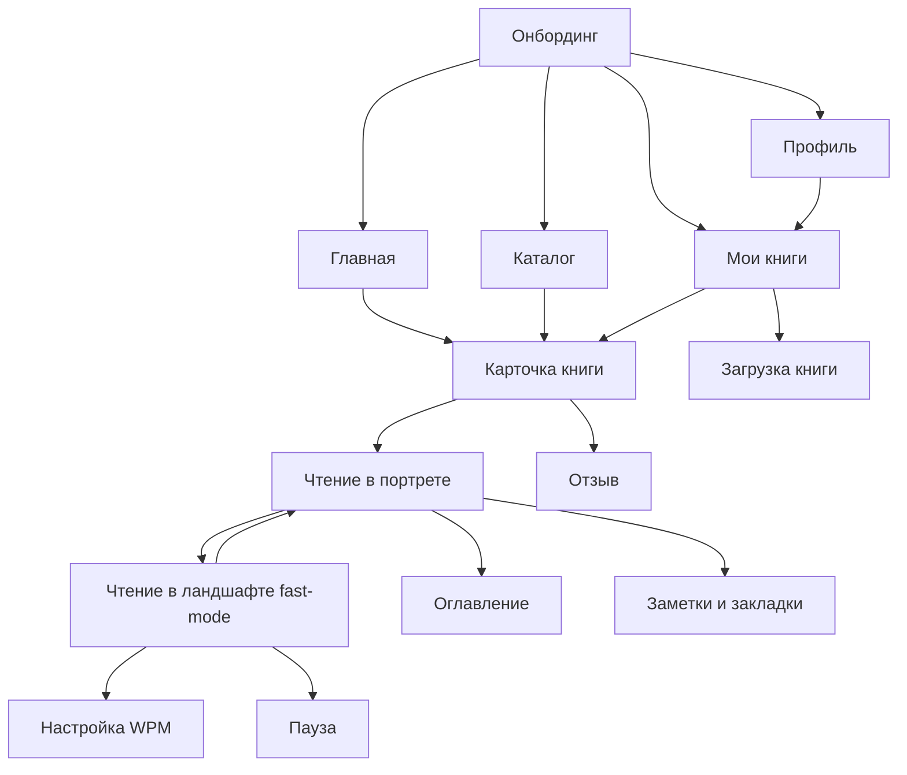
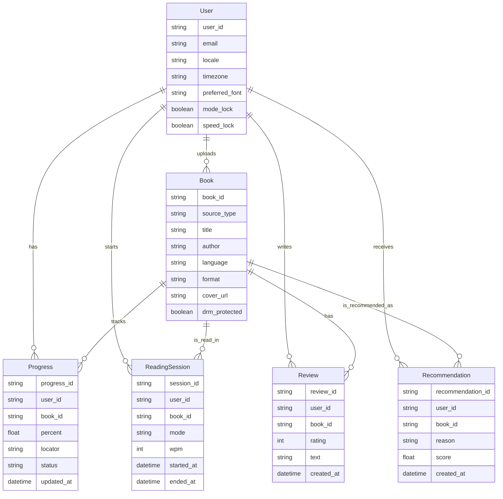

# Гибридный мобильный ридер с автопереходом в speed-reading по повороту экрана

## Резюме для руководителя

Идея выглядит **жизнеспособной и дифференцируемой**, но как продукт она сильна не в позиции «приложение для speed-reading», а в позиции **«гибридный ридер: обычное вдумчивое чтение в портретной ориентации и ускоренный режим в ландшафте»**. Это снимает главный рыночный риск: чистые RSVP/speed-reading сценарии интересны, но редко становятся единственным способом постоянного чтения, тогда как крупные ридеры выигрывают за счет библиотеки, синхронизации, заметок, рекомендаций и привычных сценариев возврата к книге. Официальные описания Apple Books, Kindle, Google Play Books, PocketBook и ReadEra подтверждают, что рынок уже ценит именно комбинацию библиотеки, синка, целей чтения и работы с несколькими форматами; при этом speed-reading обычно существует отдельно от полноценных библиотечных функций. citeturn14search1turn14search14turn12search0turn12search1turn13search1turn12search5turn12search3

Ключевой вывод: **ваша лучшая продуктовая ставка — не заменять обычное чтение, а дополнять его fast-режимом**, который включается естественным для мобильного устройства действием — поворотом телефона. Это соответствует платформенному тренду на адаптивные интерфейсы и уважение к пользовательской ориентации устройства, но требует обязательных предохранителей: понятного онбординга, режима блокировки автопереключения, сохранения состояния при ротации и аккуратной обработки системных configuration changes. Android прямо рекомендует корректно обрабатывать смену ориентации и другие runtime changes, а Apple ориентирует разработчиков на адаптивную компоновку и сохранение состояния интерфейса между запусками и изменениями среды. citeturn2search0turn2search3turn9search0turn9search7turn9search10

С точки зрения UX, концепт наиболее силен в таком виде: **портрет — обычная пагинация по тапам, ландшафт — ускоренное последовательное чтение с управлением WPM по зонам экрана**. Но fast-режим не стоит продавать как универсально лучший способ чтения сложных книг. Исследования по RSVP и чтению на мобильных устройствах показывают, что преимущества ускоренной подачи текста упираются в когнитивные ограничения и работу глаз; в ряде сценариев традиционная страница на телефоне оказывается быстрее или надежнее для понимания, чем RSVP. Поэтому гибридная архитектура продукта — не компромисс, а главный аргумент в его пользу. citeturn7search0turn7search1turn7search11

В терминах реализации разумный старт — **MVP на iOS и Android без собственного магазина лицензированных книг**, с упором на загрузку пользовательских EPUB/PDF, библиотеку, прогресс, статусы, рекомендации на базе простых правил и один сильный reading core. Форматы EPUB и PDF логично поддерживать в первую очередь: EPUB по стандарту рассчитан на reflow под экран, а PDF сохраняет фиксированную верстку; Readium Mobile и Readium LCP дают зрелую основу для построения чтения EPUB/PDF и защиты контента, если позже появится лицензионный каталог. citeturn16search0turn16search4turn6search10turn5search3

Итоговая рекомендация: **концепт стоит развивать**. Самая сильная версия продукта — это не «читалка, которая листает слова», а **персональный мобильный reading cockpit**: нормальное чтение, ускоренный режим, трекинг прогресса, библиотека, цели, статусы, отзывы, синхронизация и хороший каталог.

## Рыночный контекст и что именно может отличить продукт

Крупные ридеры уже закрывают базовые ожидания пользователей: библиотека, рекомендации, цели чтения, синхронизация прогресса, заметки и загрузка пользовательских файлов. Apple Books на главном экране показывает текущие книги, рекомендации, список «хочу прочесть» и reading goals; Kindle синхронизирует позицию, закладки, заметки и хайлайты между устройствами; Google Play Books позволяет загружать свои EPUB и PDF и читать их на всех устройствах; PocketBook и BookFusion делают ставку на облачную библиотеку и синхронизацию; ReadEra выигрывает широтой форматов и офлайном без рекламы. Отдельные speed-reading приложения вроде Outread подчеркивают фокус на небольших чанках текста и центрированном потоке, но у них обычно нет столь же сильной экосистемы каталога, статусов, целей и «домашней» библиотеки. citeturn14search1turn14search14turn12search0turn12search1turn13search1turn13search3turn12search5turn12search3

Из этого следует важный стратегический вывод: **ваша ниша не занята напрямую**. На рынке есть либо полноценные ридеры без выраженного speed-reading ядра, либо speed-reading инструменты без глубокой библиотечной и аккаунтной модели. Значит, конкурентное преимущество может быть построено на трех вещах одновременно:  
во-первых, на **аппаратно-нативном переключении режимов через ориентацию**;  
во-вторых, на **едином reading state**, который не рвет восприятие при переходе из обычного режима в быстрый;  
в-третьих, на **социально-библиотечной оболочке** — статусы, заметки, отзывы, цели, бейджи, рекомендации.

При этом research-база дает повод быть осторожным в продуктовых обещаниях. Согласно академическим публикациям, ограничения скорости чтения связаны не только с моторикой глаз, но и с когнитивной обработкой текста; исследования RSVP на мобильных устройствах и в лабораторных условиях не подтверждают, что ускоренная последовательная подача текста универсально превосходит традиционную страницу по качеству чтения. Для рынка это значит, что коммуникация приложения должна звучать не как «читайте всё в три раза быстрее», а как **«переключайтесь между глубоким и ускоренным чтением в зависимости от задачи»**. citeturn7search0turn7search1turn7search11

### Сравнение релевантных конкурентов

| Приложение | Что подтверждено официально | Сильные стороны | Слабые стороны относительно вашей идеи | Источники |
|---|---|---|---|---|
| Apple Books | Главная с current reading, рекомендациями, Want to Read, reading goals; кастомизация тем, шрифтов, интервалов; синхронизация между устройствами Apple | Сильный home, цели чтения, polished UX, экосистема | Нет явной speed-reading концепции, нет rotation-first fast mode | citeturn14search1turn14search14turn0search4 |
| Kindle | Синхронизация позиции, закладок, заметок, хайлайтов; Page Flip; чтение на разных устройствах | Лучший кросс-девайс reading continuity, зрелые заметки | Экосистемный уклон Amazon, нет публичной идеи fast-mode по ориентации | citeturn12search0turn12search4turn12search7 |
| Google Play Books | Загрузка EPUB/PDF, чтение на всех устройствах; экспорт купленных книг там, где разрешает издатель | Отличный сценарий «загрузил свои книги и продолжил везде» | Менее выразительный reading identity; speed-reading отсутствует | citeturn12search1turn11search0turn11search6 |
| ReadEra | Широкая поддержка форматов, офлайн, без рекламы, без навязчивых покупок | Очень сильна как utilitarian reader для своих файлов | Слабее как социально-каталоговый продукт с рекомендациями и прогресс-метриками уровня экосистем | citeturn0search2turn12search5turn12search12 |
| PocketBook Reader | Синхронизация библиотеки, позиции, заметок; поддержка множества форматов, OPDS, DRM/LCP | Сильный кандидат по sync + formats + store/library | Нет простого потребительского fast-reading ядра как главной фичи | citeturn13search1turn13search8turn13search19 |
| Outread | Speed-read websites/ebooks/documents, centered text, чтение небольшими чанками | Хороший референс именно для fast-reading UX | Не выглядит как полноценный «дом» для библиотеки, каталога и профиля читателя | citeturn12search3turn12search6turn1search19 |

Практический вывод из сравнения простой: **у вас есть шанс занять промежуточный сегмент между Apple Books/Kindle и Outread**. Но продукт должен стартовать с полноценной библиотеки и нормального reading mode; иначе его будут воспринимать как нишевую «игрушку для прокачки скорости».

## Продуктовая стратегия и UX-принципы

Я бы формулировал продукт таким образом: **это мобильный ридер для двух режимов чтения, а не speed-reading тренажер с библиотекой**. Такая формулировка лучше соответствует и рынку, и исследованиям, и ожиданиям пользователей.

Главный UX-принцип здесь — **режимы должны быть не похожими, а комплементарными**. Портрет нужен для длинного, внимательного, структурного чтения: навигация по страницам, оглавление, заметки, возврат к абзацу, сканирование структуры книги. Ландшафт нужен для ускоренного прохода по линейному тексту: обзор знакомого раздела, перечитывание, разгон на публицистике, non-fiction с простой синтаксической структурой, короткие главы, статьи. Именно так fast-mode перестает конфликтовать с нормальным чтением и начинает его усиливать. Это логично и с точки зрения ограничений RSVP, и с точки зрения того, как крупные ридеры сегодня строят core reading experience. citeturn7search0turn7search1turn12search3turn14search14

### Рекомендуемая модель жестов

В портрете схема, которую вы описали, выглядит правильно и достаточно «книжно»:

- тап по правой части — следующая страница;
- тап по левой части — предыдущая страница;
- внизу — прогресс-бар;
- маленькая кнопка замка — управление автопереключением режима.

В ландшафте логика тоже выглядит сильной:

- тап по центру — пауза/продолжить;
- тап справа — увеличить WPM;
- тап слева — уменьшить WPM;
- краткий transient feedback: `+25 WPM` / `-25 WPM`;
- в нижней зоне — текущая скорость, прогресс, статус lock.

С точки зрения ergonomics это лучше, чем постоянный видимый слайдер: зоны экрана позволяют регулировать скорость, не уводя глаза далеко от центра. Но точная настройка скорости все же нужна. Поэтому в fast-mode я бы добавил **вторичный способ точной регулировки**: тап по индикатору `320 WPM` открывает мини-скраббер или круговой dial. Основное управление остается таповым, точная настройка — вторичной. Это ближе к паттернам, которые уже работают в мультимедийных приложениях, и не перегружает reading canvas.

### Mode-lock и speed-lock

Для вашего продукта нужны **два разных lock-механизма**, даже если визуально сначала кажется, что хватит одного.

**Mode-lock** должен отвечать на вопрос: «менять ли режим при повороте устройства». Это обязательная функция, потому что пользователи читают лежа, в транспорте, на подушке, в нестабильных положениях; кроме того, сами платформы поощряют адаптивность и уважение к предпочтительной ориентации пользователя, а не агрессивное принуждение к одной модели. citeturn2search3turn9search0turn9search10

**Speed-lock** отвечает на другой вопрос: «можно ли менять WPM случайными тапами». Он нужен уже не всем, поэтому в MVP его можно спрятать на второй уровень: long-press по индикатору WPM или маленький lock внутри панели fast-mode.

Оптимальная модель для MVP выглядит так:

- короткое нажатие на замок: `Автопереключение: вкл/выкл`;
- long-press на замок в fast-mode: `Зафиксировать скорость`.

### Онбординг для rotation-based mode switch

Ваша core-механика необычна, и это плюс. Но она не должна быть «магией без объяснения». Онбординг должен быть очень коротким и практичным, буквально из трех экранов.

Пример текста:

**Экран 1**  
**Заголовок:** `Два режима чтения`  
**Текст:** `Держите телефон вертикально для обычного чтения. Поверните горизонтально, чтобы перейти в быстрый режим.`

**Экран 2**  
**Заголовок:** `Быстрый режим`  
**Текст:** `Тап по центру — пауза. Справа — быстрее. Слева — медленнее.`

**Экран 3**  
**Заголовок:** `Управляйте поворотом`  
**Текст:** `Если читаете лежа или не хотите случайных переключений, включите замок режима.`

Нужно также показать микроанимацию поворота устройства и текстовое подтверждение при первом входе в fast-mode:  
`Быстрый режим включен`  
`Скорость: 250 WPM`  
`Можно изменить в любой момент`

### Ошибки и пограничные сценарии

Самая большая UX-ошибка здесь — воспринимать ротацию как всегда надежный и желаемый сигнал. На практике нужны предохранители.

| Сценарий | Риск | Рекомендуемое поведение |
|---|---|---|
| Пользователь читает лежа | Случайный вход в fast-mode | По умолчанию спросить при первом случайном повороте: `Переключаться в быстрый режим при повороте?` |
| Системный lock orientation включен | Конфликт ожиданий | Показать подсказку: `Автопереключение недоступно, пока ориентация экрана зафиксирована системой` |
| Быстрая «болтанка» между портретом и ландшафтом | Дребезг режима | Ввести порог устойчивости 400–700 мс перед сменой режима |
| Звонок или сворачивание приложения в fast-mode | Потеря контекста | Сохранять последнюю позицию, WPM, состояние play/pause и восстанавливать его после возврата |
| PDF с жесткой версткой | Fast-mode может работать плохо | Разрешать fast-mode только после успешного извлечения текстового слоя; иначе оставить только обычное чтение |
| Слишком большой или битый файл | Ошибка импорта | Пошаговый upload-state: `Загружаем`, `Проверяем формат`, `Извлекаем обложку`, `Готово` или понятный fail-state |

Apple и Android обе подчеркивают важность сохранения состояния интерфейса и корректной обработки configuration/runtime changes; для вашей идеи это не техническая деталь, а часть core UX. citeturn2search0turn9search7turn9search16

## Экранная архитектура и вайрфреймы

Ниже — логика экранов, которая лучше всего поддерживает концепт «ридер сначала, speed-mode как суперсила сверху».

### Поток экранов приложения



### Главная

Главная должна быть **операционной**, а не журнальной. Пользователь приходит сюда либо продолжить чтение, либо взять следующую книгу, либо проверить цель. Поэтому я бы строил экран так:

Сверху — приветствие и быстрый контекст:  
`Продолжить чтение`  
одна крупная карточка и рядом еще 1–2 недавние книги меньшего размера.

Ниже — блок целей:  
ежедневная цель, серия дней, прогресс по году.

Потом — рекомендации:  
отдельные горизонтальные рельсы  
`Похожие на то, что вы читаете`  
`Авторы, которые могут понравиться`  
`Продолжить серию`  
`Новые в любимых жанрах`

Наконец — быстрые действия:  
`Открыть каталог`  
`Загрузить книгу`  
`Перейти в "Мои книги"`

Здесь я **не рекомендую бесконечную ленту**. На главной лучше работают короткие, объяснимые наборы с явной кнопкой `Показать все`. Бесконечный скролл уместнее в каталоге, где у пользователя discovery-intent, а не task-intent.

**Микрокопирайтинг для главной:**

- `Продолжить`
- `Вы остановились на 42%`
- `Сегодня осталось 18 минут до цели`
- `Потому что вы читаете Терри Пратчетта`
- `Серия: 6 дней подряд`

### Каталог

Каталог должен закрывать две разные задачи: **поиск по известному запросу** и **обзор по категориям**. Поэтому сверху нужен sticky search bar, а ниже — не только жанры, но и самостоятельные входы в каталог по авторам.

Рекомендуемая структура:

- поисковая строка с автодополнением;
- чипы фильтров: `Жанры`, `Авторы`, `Язык`, `Формат`, `Рейтинг`, `Длина`, `Новинки`;
- editorial blocks: `Популярное`, `Короткие книги`, `Подойдет для fast-mode`, `Русская классика`, `Психология`, `Фантастика`;
- endless scroll допустим здесь, но только после выбора раздела или поиска.

Для такого каталога нужен не просто CRUD по книгам, а полноценный поисковый слой с typo tolerance, synonyms и фасетами. Firestore как база синка и состояния подходит хорошо, но для поиска по книгам и авторам лучше выделенный движок — например, Algolia/Meilisearch/OpenSearch. Firebase прямо предлагает extension `Search with Algolia`, а Meilisearch и OpenSearch официально документируют typo tolerance и synonyms как базовые инструменты релевантного каталожного поиска. citeturn17search18turn17search1turn17search2turn17search11

### Мои книги

Это должен быть **рабочий стол читателя**, а не просто список файлов. Раздел логично строить вокруг статусов, которые вы уже предложили:

- `Читаю`
- `Прочитал`
- `Брошено`
- `Хочу прочитать`

У Goodreads и StoryGraph такие shelf/status-модели давно доказали полезность для читательского трекинга, а Goodreads в 2026 году даже добавил официальный shelf `Did Not Finish`, признав важность учета незаконченных книг. Это сильный аргумент в пользу вашего статуса `брошено`: он не побочный, а продуктово оправданный. citeturn14search13turn15search5turn14search12

Внутри `Моих книг` я бы добавил:

- переключатель вида `Сетка / Список`;
- фильтры по статусу, автору, жанру, формату, языку;
- поле `Заметки`;
- кнопки `Загрузить книгу` и `Импортировать из файлов`.

Для каждой книги в списке стоит показывать мини-мета:

- обложка;
- название;
- автор;
- статус;
- прогресс;
- последняя активность;
- иконка заметок, если они есть.

### Профиль

Профиль должен быть **не социальной витриной, а dashboard достижений**. В первом релизе достаточно:

- книг прочитано за год;
- текущие книги;
- среднее время чтения в день;
- медианная скорость fast-mode;
- серия дней;
- бейджи;
- последние отзывы.

Бейджи должны поддерживать образ продукта, а не быть игровым шумом. Полезные типы:

- `7 дней подряд`
- `Первая загруженная книга`
- `10 завершенных книг`
- `1 час в fast-mode`
- `Вернулся к брошенной книге`
- `Завершил книгу в двух режимах`

### Reading screen в портрете

Это должен быть **максимально спокойный экран**:

```text
┌───────────────────────────────┐
│                               │
│   Обычная страница книги      │
│   ...                         │
│   ...                         │
│   ...                         │
│                               │
│                               │
│                               │
├───────────────────────────────┤
│ 🔒       42%        ⋯         │
└───────────────────────────────┘
```

Ключевые элементы:

- минимальный chrome;
- нижний прогресс-бар;
- маленький lock;
- overflow menu `⋯` для оглавления, темы, шрифта, заметок.

Я поддерживаю ваше решение **не делать center tap обязательным**. Для чтения это действительно ближе к «книге», а не к медиаплееру.

### Reading screen в ландшафте fast-mode

```text
┌───────────────────────────────────────────────┐
│  -25 WPM             Пауза/Play          +25 WPM │
│                                               │
│                 previous  CURRENT  next      │
│                                               │
│                                               │
├───────────────────────────────────────────────┤
│ 🔒        320 WPM          42%         ⋯      │
└───────────────────────────────────────────────┘
```

Рекомендации для этой зоны:

- центральное слово — резкое;
- соседние слова — приглушенные, но видимые;
- transient feedback — поверх слова, не внизу;
- нижняя панель минимальна: lock, WPM, progress, overflow;
- по умолчанию шаг скорости: `±25 WPM`;
- long-press по правой/левой зоне — ускоренное изменение.

### Два визуальных варианта

#### Compact

Подходит для power users и плотного информационного интерфейса.

```text
Главная
┌───────────────────────────────┐
│ Привет, Дастан               │
│ Продолжить чтение             │
│ [Большая карточка книги]      │
│ [Книга] [Книга]               │
│ Цель: 28 / 40 мин             │
│ Рекомендации ->               │
│ [карточки в 2 ряда]           │
└───────────────────────────────┘
```

Плюсы: больше контента на экране, быстрее навигация, выше utility.  
Минусы: слабее эмоциональность и «премиальность».

#### Immersive

Подходит для editorial-впечатления и более дорогого визуального образа.

```text
Главная
┌───────────────────────────────┐
│ Добрый вечер                  │
│                               │
│      [Крупная обложка]        │
│      Продолжить               │
│      42% • 18 мин осталось    │
│                               │
│ Цель на сегодня               │
│ [круговой прогресс]           │
│                               │
│ Авторы для вас ->             │
│ [крупные карточки]            │
└───────────────────────────────┘
```

Плюсы: сильнее бренд, чище визуально, лучше продает идею продукта.  
Минусы: меньше плотность данных, больше скролла.

**Практический совет:** для MVP лучше выбрать **compact на библиотечных экранах** и **immersive внутри чтения и главной**. Это дает хороший баланс utility и identity.

## Доступность, локализация и чтение на разных устройствах

Доступность здесь не вторичная тема, а продуктовая: ваш app literally продает комфорт чтения. Apple в 2025 и 2026 годах отдельно развивает Accessibility Reader для пользователей с дислексией и слабым зрением, с настройками шрифта, цвета и интервалов; Apple HIG также указывает на Dynamic Type как системный механизм масштабирования текста. На Android с Android 14 поддерживается нелинейное масштабирование шрифтов до 200%, а Material/Android guidance требует учитывать locale и layout direction. Это означает, что ваш ридер должен поддерживать **масштабируемый интерфейс**, а не только красивый дефолт. citeturn3search8turn3search0turn3search1turn3search2turn4search19

### Что обязательно сделать по accessibility

Минимально качественный набор такой:

- системное масштабирование UI-текста и in-book текста;
- выбор шрифтов и межстрочного интервала;
- контраст текста к фону не ниже WCAG AA: 4.5:1 для обычного текста и 3:1 для крупного; для UI-компонентов — не ниже 3:1;
- светлая, сепия, темная тема;
- режим повышенного интервала между буквами и строками;
- возможность отключить анимации или уменьшить их;
- VoiceOver/TalkBack labels для всех зон fast-mode;
- haptic feedback при смене WPM;
- пауза по входящему звонку, аудиосессии, системному interrupt. citeturn2search4turn2search10turn2search14

Для пользователей с дислексией я бы не обещал «волшебный шрифт». Гораздо сильнее сделать **набор профилей читабельности**:

- `Стандарт`
- `Повышенная читабельность`
- `Дислексия`
- `Низкое зрение`

Профиль `Дислексия` может включать более крупный sans-serif, больше letter spacing, увеличенный line height и более мягкий контрастный фон. Если захотите, позже можно добавить опциональные шрифты вроде OpenDyslexic или Dyslexie, но как **дополнительный выбор**, а не как обязательный дефолт. citeturn2search2turn2search5turn3search8

### Локализация и RTL

Если приложение выйдет хотя бы на русский и английский, архитектуру уже нужно строить так, будто у вас будет и RTL. Android поддерживает per-app language preferences, а Apple отдельно документирует поддержку right-to-left и локализованных символов. Это важно не только для текстов, но и для **жестов перелистывания**. В арабском и иврите интерфейс и направленные иконки обычно зеркалятся, поэтому «тап справа — следующая страница» не должен быть жестко зашит как универсальное правило; для RTL-пользователей нужен locale-aware режим или явная настройка `Направление перелистывания`. citeturn4search0turn4search8turn4search17turn4search19

Рекомендация по i18n:

- строки локализуются полностью, включая микрокопирайтинг fast-mode;
- названия статусов тоже локализуемы, но внутренне храним нейтральные enum-значения;
- все численные форматы, даты, проценты и время чтения — locale-aware;
- автоподстановка языка книги не должна менять язык интерфейса без разрешения пользователя.

### Синхронизация между устройствами

Пользователь быстро привыкает к тому, что книга «помнит, где он остановился». Apple Books синхронизирует страницу, заметки, выделения и коллекции между устройствами Apple, Kindle синхронизирует позицию и annotations, PocketBook и BookFusion синхронизируют библиотеку и reading position. Следовательно, для вашего продукта это не nice-to-have, а базовое ожидание. citeturn0search4turn12search0turn13search1turn13search3

Я рекомендую модель синка на уровне:

- `last_position`
- `progress_percent`
- `last_opened_at`
- `last_mode`
- `current_wpm`
- `highlights`
- `notes`
- `device_id`
- `updated_at`

При конфликте между устройствами лучше не молча «побеждать последним»: покажите человеку понятный choose-state, если расхождение заметное. Пример микрокопии:  
`Мы нашли две позиции чтения`  
`Телефон: глава 8, 42%`  
`Планшет: глава 9, 47%`  
`Продолжить с более поздней позиции`

Технически такой sync-слой хорошо ложится на Firestore: у него есть realtime sync и offline persistence, а Cloud Storage покрывает загрузку файлов с возобновлением операций при плохой сети. citeturn5search0turn5search4turn5search6

## Контент, форматы, загрузка и backend-архитектура

### Форматы книг и обработка загрузки

Для первого релиза достаточно **EPUB и PDF**. Это не случайный выбор: EPUB по стандарту предназначен для reflow под доступное пространство экрана, а также может содержать fixed-layout документы; reading systems обязаны поддерживать fixed-layout EPUB. PDF, напротив, сохраняет фиксированное представление, и его доступность сильно зависит от наличия тегов и логической структуры документа. Из этого следует прямое продуктовое правило: **портретный режим должен работать для EPUB и PDF, а ландшафтный fast-mode — полноценно только там, где есть пригодный текстовый слой и линейный reading order**. citeturn16search0turn16search4turn6search3turn6search0

Загрузка книги должна выглядеть как pipeline, а не как «файл просто появился»:

1. `Выберите файл`
2. `Загружаем`
3. `Проверяем формат`
4. `Извлекаем данные книги`
5. `Добавляем в библиотеку`

Желательно автоматически извлекать:

- название;
- автора;
- обложку;
- язык;
- количество страниц/sections;
- оглавление;
- описание, если оно есть в metadata.

Google Play Books и Apple Books уже приучили пользователей к тому, что свои EPUB/PDF можно импортировать в личную библиотеку; ваш UX должен быть не хуже этого базового стандарта. citeturn11search0turn11search6turn11search4

### DRM и лицензионный каталог

Для MVP я бы **не строил собственный лицензируемый магазин книг**. Это резко усложняет продуктовую, юридическую и техническую часть: контракты с правообладателями, защита контента, биллинг, налоги, география прав.

Если позже каталог появится, не стоит изобретать собственный DRM. Readium LCP официально поддерживает EPUB и PDF и интегрируется с Readium Mobile; PocketBook тоже отдельно подчеркивает поддержку DRM/LCP. Это делает LCP разумным кандидатом для v2/v3, если приложение пойдет в сторону B2B или партнерств с издателями и библиотеками. citeturn5search3turn5search7turn6search10turn13search8

Практическое разделение такое:

- **пользовательские загрузки** — только личные DRM-free файлы;
- **будущий магазин/подписка** — отдельный контентный канал, потенциально через LCP;
- **неподдерживаемые форматы** — понятный fail-state, а не «тихое молчание».

### Поиск, рекомендации и библиотечный backend

Функционально backend распадается на четыре слоя.

Первый слой — **identity и аккаунт**. Firebase Authentication поддерживает email/password и email-link sign-in, чего для MVP более чем достаточно. citeturn5search5turn5search17

Второй слой — **состояние пользователя и прогресс**. Firestore подходит для хранения полок, прогресса, сессий, заметок, статусов и отзывов, особенно если вы хотите offline-first поведение и синк после восстановления сети. citeturn5search0turn5search4

Третий слой — **файлы и обложки**. Cloud Storage for Firebase покрывает прямые клиентские upload/download и возобновление операций при плохой связи. citeturn5search2turn5search6

Четвертый слой — **каталожный поиск и рекомендации**. Для поиска — внешний индекс с фасетами и typo tolerance. Для рекомендаций на MVP достаточно rules-based системы:

- похожие по автору;
- похожие по жанру;
- продолжение серии;
- популярное в favorite genres;
- «вернитесь к брошенной книге».

Если продукт вырастет, рекомендации можно усложнить до real-time personalization: и Amazon Personalize, и Google recommendation tooling поддерживают персонализированные item recommendations на основе взаимодействий пользователя. Но это скорее история для v2+, после накопления достаточного массива событий. citeturn18search0turn18search3turn18search11turn18search1turn18search4

### Модель данных



### Что я бы заложил в backend сразу

Даже для MVP есть смысл заложить несколько вещей прозапас:

- версионируемый locator для EPUB и PDF;
- idempotent events для reading sessions;
- модерацию отзывов, если они публичные;
- async-пайплайн нормализации metadata;
- server-side feature flags для онбординга, лока и fast-mode экспериментов;
- экспериментальные bucket-ы для разных вариантов главной страницы.

## Аналитика, монетизация и дорожная карта

### Какие события нужно трекать

Firebase Analytics официально поддерживает логирование custom events и screen_view; App Store Connect Analytics помогает смотреть acquisition и performance на стороне Apple. Для вас analytics — это не только growth, но и проверка главной гипотезы: **работает ли rotation-based fast mode как реальная ценность, а не просто эффектная демо-фича**. citeturn19search0turn19search2turn19search10turn19search1

Я бы трекал как минимум четыре слоя событий.

**Навигация:**

- `screen_view_home`
- `screen_view_catalogue`
- `screen_view_my_books`
- `screen_view_profile`
- `screen_view_reader_portrait`
- `screen_view_reader_landscape`

**Библиотека и каталог:**

- `book_upload_started`
- `book_upload_completed`
- `book_upload_failed`
- `catalog_search`
- `catalog_filter_applied`
- `book_opened`
- `recommendation_clicked`

**Чтение:**

- `reading_session_started`
- `reading_session_ended`
- `mode_switch_portrait_to_fast`
- `mode_switch_fast_to_portrait`
- `wpm_increased`
- `wpm_decreased`
- `pause_play_toggled`
- `mode_lock_toggled`
- `speed_lock_toggled`
- `note_created`
- `highlight_created`

**Результаты:**

- `book_completed`
- `status_changed_to_abandoned`
- `review_submitted`
- `goal_completed_daily`
- `streak_extended`

Главные KPI для первых месяцев:

- доля пользователей, дошедших до первой завершенной книги;
- доля читателей, которые хотя бы раз осознанно активировали fast-mode;
- retention у пользователей, использующих обе ориентации, vs только портрет;
- медианный WPM и доля сессий с добровольной корректировкой скорости;
- upload success rate;
- completion rate по импортированным книгам.

### Монетизация

Так как модель монетизации в запросе не задана, я рассматриваю ее как открытую. Для iOS и Android у вас есть стандартные опции: one-time purchase, non-consumable unlock и подписка; обе платформы официально поддерживают цифровые товары и подписки через свои billing-системы. citeturn10search2turn10search10turn10search18turn10search1

Лучшие варианты для этого продукта такие.

**Freemium с подпиской**  
Бесплатно: чтение своих книг, базовая библиотека, 1 устройство, ограниченный fast-mode.  
Подписка: синхронизация, расширенные статистики, заметки, рекомендации, дополнительные темы, advanced fast controls.

**Бессрочный unlock + подписка на облако**  
One-time unlock открывает core reader полностью.  
Подписка — только за sync, backup, большие uploads, расширенные рекомендации.  
Это может быть особенно убедительно для аудитории ридеров, которая часто плохо реагирует на навязчивые recurring fees.

**Собственный каталог книг**  
Потенциально сильная выручка, но это не MVP из-за лицензий, DRM и операционных затрат.

Мой вывод: **лучший путь — freemium или one-time unlock + optional cloud subscription**.  
Для reading-продукта я бы избегал рекламной монетизации внутри сессий чтения: она разрушает core value.

### Приоритеты по impact vs effort

| Фича | Impact | Effort | Приоритет | Почему |
|---|---:|---:|---|---|
| Портретный reader с тапами и прогресс-баром | Очень высокий | Средний | Срочно | Это базовый reading core |
| Ландшафтный fast-mode | Очень высокий | Средний | Срочно | Главная дифференциация |
| Mode-lock | Очень высокий | Низкий | Срочно | Снимает главный UX-риск |
| Загрузка EPUB/PDF | Очень высокий | Средний | Срочно | Без этого MVP пуст |
| My Books со статусами | Высокий | Низкий | Срочно | Формирует привычку и структуру |
| Прогресс и синк между устройствами | Очень высокий | Средний | Срочно | Базовое ожидание рынка |
| Каталог с поиском и фильтрами | Высокий | Средний | Высоко | Discovery и возвращаемость |
| Заметки | Средний | Средний | Высоко | Усиливает удержание и полезность |
| Отзывы | Средний | Низкий | Средне | Полезно, но не core для MVP |
| Профиль с бейджами | Средний | Низкий | Средне | Хорошо для retention, но можно упростить |
| Персонализированные рекомендации ML | Высокий | Высокий | Позже | Нужны данные и время |
| DRM-каталог | Высокий | Очень высокий | Позже | Сильная бизнес-фича, но не первый релиз |
| OPDS/партнерские каталоги | Средний | Средний | Позже | Хорошо для v2/v3 |

### Рекомендуемый roadmap

#### MVP

MVP должен доказать одну вещь: люди не просто пробуют fast-mode, а **встраивают его в свой реальный reading loop**.

Состав MVP:

- авторизация;
- импорт EPUB/PDF;
- библиотека `Мои книги`;
- статусы: `читаю`, `прочитал`, `брошено`, `хочу прочитать`;
- портретный reader;
- ландшафтный fast-mode;
- mode-lock;
- базовый speed control;
- прогресс-бар;
- синк прогресса между устройствами;
- главная с `Продолжить`, 1–3 недавними книгами и простой goal-card;
- каталог с поиском, авторами и жанрами;
- минимум аналитики.

#### V1

V1 — это уже polished consumer product.

Добавить:

- заметки и хайлайты;
- speed-lock;
- расширенные настройки fast-mode;
- отзывы;
- профиль со статистикой и бейджами;
- рекомендации по правилам;
- импорт обложек и richer metadata;
- accessibility presets;
- in-app language setting.

#### V2

V2 — это рост и экосистема.

Добавить:

- продвинутые рекомендации;
- cloud backup/history;
- OPDS и партнерские каталоги;
- DRM/LCP для лицензионного контента;
- shared highlights / экспорт заметок;
- чтение серий и author-follow;
- A/B tested home rails;
- более развитый social layer.

## Итоговая оценка концепции

Идея сильная не потому, что предлагает «читать быстрее», а потому, что предлагает **естественно переключаться между двумя когнитивно разными режимами чтения на одном устройстве**. В этом ее реальное отличие от обычных ридеров и speed-reading утилит. Концепт опирается на уже подтвержденные рынком потребности — библиотека, синхронизация, цели чтения, персональные полки, импорт собственных книг, рекомендации — и добавляет поверх них уникальный interaction model через ориентацию устройства. citeturn14search1turn12search0turn12search1turn13search1turn12search3

Если делать честный продуктовый вывод, то он такой: **идея хорошая, но только в гибридной форме**. Если убрать сильный обычный reader, останется нишевый speed tool. Если убрать fast-mode, получится еще один ридер без четкой причины существовать. Если же соединить оба мира аккуратно — с понятным онбордингом, lock-механикой, strong library core, хорошим каталогом, поддержкой EPUB/PDF, sync и доступностью — концепт имеет шанс стать не просто эффектным, а привычным ежедневным продуктом.

### Ключевой микрокопирайтинг на русском

**Lock и режимы**
- `Автопереключение включено`
- `Обычный режим зафиксирован`
- `Быстрый режим зафиксирован`
- `Скорость зафиксирована`

**Fast-mode**
- `Быстрый режим`
- `Пауза`
- `Продолжить`
- `+25 WPM`
- `-25 WPM`
- `Скорость: 320 WPM`

**Progress и goals**
- `Вы остановились на 42%`
- `До цели сегодня осталось 18 минут`
- `Книга завершена`
- `Вернуться к чтению`

**Upload**
- `Выберите EPUB или PDF`
- `Проверяем файл`
- `Извлекаем обложку`
- `Книга добавлена в библиотеку`
- `Не удалось открыть файл`

**Statuses**
- `Читаю`
- `Прочитал`
- `Брошено`
- `Хочу прочитать`

### Официальные страницы, полезные как визуальные референсы интерфейса

Для поиска визуальных референсов и подтверждения конкурентных паттернов полезнее всего смотреть официальные страницы и листинги Apple Books, Kindle, Google Play Books, PocketBook, ReadEra и Outread. citeturn14search5turn12search4turn12search1turn13search1turn12search12turn12search3